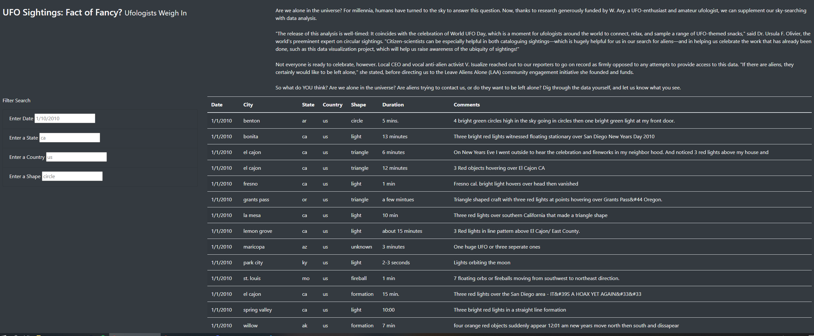
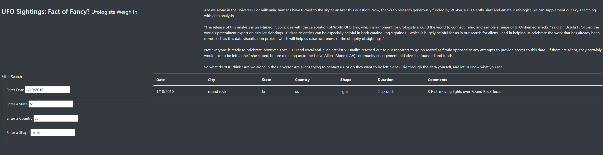

# UFOs
## Overview

The purpose of this project is to display data in a table on UFO observations, filtering by multiple criteria. These criteria are state, country, date, and shape. The website also displays titles and an informational testimonial from a known Ufologist.

## Results

Upon loading the website, the unfiltered UFO data is displayed to a table. 

Adding a filter to one of the boxes causes the updateFilter function to run and initialize the filter into an array. The function then calls the filterTable function to apply the new filter to the data and assemble the new table. Up to four filters can be added. Here, we are filtering by state and date.

## Summary

One drawback of the design is that the filtering process only allows for the filtering of a singular date. Another drawback is that there is no filter for comments or duration. The filter for duraction and comments would be difficult as there are a variety of entry types. Perhaps some form of regex could be used in the later case, while a complete redesign of the code would be needed to allow for date range filtering.
